# Home Assistant 新手入门

个人学习 HA 到入门，大约花了足足一周，期间走了许多弯路。

HA 说是入门比较简单，但其实许多教程都说得比较含糊笼统。或者只是一些片段，懂的人很好理解，但新人很难搞明白到底怎么才能把这些片段组合到一起并生效。

另外就是 HA 的各种组件模块很多，可以实现很复杂的功能。但对新人来说就很容易看花眼，不知道该如何取舍。

作为初学者，一开始想实现个非常简单的功能，都无从下手，非常头大。所以就想分享一下我的一些配置。同时我给很多文件加了详细的注解，希望能帮助新玩家快速地入门。

**通过这个教程，你可以完成一个完整的流程。**  
从搭建后台，到修改配置文件，到编辑前端页面。  
从而大致掌握 HA 的用法和原理，快速入门。

## Home Assistant 能做什么

通过一个统一的平台，**控制所有的智能设备**（开关/插座/遥控器/智能家电）。跳过各个硬件厂商自己做的 App。

因为最终控制端是网页的形式，所以**电脑手机都可以进行控制**。

还可以直接用 iOS 上的 **Home App** 控制你的设备，也就可以用 **Siri** 来控制家电。

自由设定各种 **自动化** 和场景，可以把规则订得非常精细复杂。比如：

- 到家自动开灯放歌开空调
- PM2.5 爆表了自动开空气净化装置
- 有陌生人来家里了自动记录
- 等等

## 准备工作

- **需要拥有至少一个智能设备**  
    + 我是博联的万能遥控器 RM Pro+，比较方便接管各种传统家电。  
    + 你也可以从插座开关等小东西入手，但最好先搜索一下，确认该设备能不能接入HA。比如博联的天猫精灵定制款，据说就很难下手。
    + 如果你现成有一个智能家电，比如空调/冰箱/电视等等，那起点就比我高了。

- **一些基础的计算机知识**
    + 比如文件相对路径 / ip地址 / mac地址 / 简单的命令行（至少会复制黏贴回车）/ 有个文本编辑器 / 等等。
    + 升级一点要求，最好能读懂一些英文文档。这样万一我没提到的部分，你可以比较方便地找到对应的资料。无障碍访问网络的能力也是加分项。
    + 总之这部分要求不算太高，对程序员来说很基础。如果基础知识太缺乏，可能容易卡在一些比较意外的地方。

- **理解 yaml 文件格式**
    + HA 的绝大部分改动，就是写配置文件。这几乎不应该算编程。
    + 简单来说 `yaml` 就是一个类似 `json` 的文件格式，只不过全部用缩进来控制。需要至少理解 List/Array、Dict/Table、str、int，类似这些基本的程序概念。我感觉唯一要记住的，就是用 `-` 开头来标识列表/数组。
    + 可以参考 [YAML 语言教程 - 阮一峰的网络日志](https://www.ruanyifeng.com/blog/2016/07/yaml.html)

## 原理和一些术语
这部分是我个人理解，帮助厘清一些基本概念，另外简单列几个常见的术语，我刚学的时候被这堆名词搞得头大。

### 原理

- **后台**
    + Home Assistant 是一个服务，需要运行在一个24小时不关机的硬件上。  
    + 一般玩家都是让它运行在树莓派或者路由器上。
    + 我是刚好有一台 MBA 当服务器，所以我是运行在 Mac 系统上。
    + 当然 windows 也是可以的。

- **配置**
    + 这个服务运行的时候，会读取相关的配置文件。
    + **我们使用 HA，其实主要工作，也就是修改这些配置文件。**  
    + 比如，在 `switch.yaml` 这个文件里，我们填写好博联的 ip/mac，就可以用它来控制这个设备了。  
    + 配置文件有好几个，常用的有开关 / 脚本 / 自动化 / 等，

- **前端**
    + HA 运行时会生成一个网络服务，也就是你可以通过浏览器访问到一个网页。  
    + 比如我运行 HA 的机器的 ip 是 `10.0.0.12`，就用浏览器打开 `http://10.0.0.12:8123`。  
    + 然后就可以直接在这个网页上，控制我们刚添加好的开关了。
    + 因为是网页，所以既可以电脑控制，也可以手机控制。  
        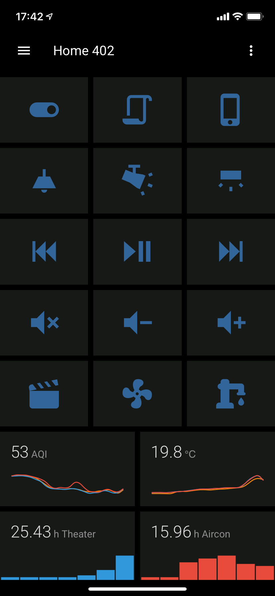

### 名词

- **HA/hass** 都是 home assistant 的简称，我懒所以用 **HA** 。类似的服务还有 **Domoticz** 等。

- **lovelace** 好像是 HA 的前端页面的一套模板的名字，大致就等同于 HA 的网页。**frontend** 也是指前端。

- **homebridge** 也是一个服务，基于NodeJS。主要是用来连接苹果的 homekit。HA 等于是控制都用自己的一套，然后通过它来转发到 homekit，实现对接。

- **博联/欧瑞博/米家/易微联** 类似这些，是几家大的智能硬件供应商。选购他们的设备前，务必确认一下是否能接入 HA。比如有些天猫精灵定制版，要接入就很麻烦，新人的话非常不推荐了。现在各家都在圈地，大都硬件厂商做的 App 都比较粗糙。
- 另外**天猫精灵/米家**，还有京东好像也有一个，都是类似 HA 的服务平台，试图成为统一的硬件管理入口。

- **[ZigBee](https://zh.wikipedia.org/wiki/ZigBee)** 一种物联网协议。

## 教程正文

### Step 1. 安装 Home Assistant

- 首先你要有 python，从这里安装 [Download Python | Python.org](https://www.python.org/downloads/)。直接装就完了，这步不展开了。

- 然后有了 python 你应该就有了 pip。简单来说，在命令行键入 `pip install homeassistant` 。万一提示 pip 命令不存在，自己查资料看看怎么解决。

- 其它也有直接下载打包文件，或者 docker 之类的，懂的自然懂，小白也没必要学。  

- 扩展阅读
    + [Install Home Assistant - Home Assistant](https://www.home-assistant.io/getting-started/)
    + [Installation of Home Assistant - Home Assistant](https://www.home-assistant.io/docs/installation/)

### Step 2. 初次运行

- 直接在命令行键入 `hass --open-ui` 就可以了。  
    这里命令行指 Mac 下的 `Terminal`，Win 下 `命令提示符`。

- 第一次运行，会下载一大堆的依赖文件，比较耗时。

- HA 的 **配置文件根目录**
    + Mac 默认是 `~/.homeassistant/`。  
        打开该目录方式有两种，一种是在 finder 按 `cmd+shift+G`，然后粘贴上述地址进入该目录。  
        另一种方法是在自己用户名的根目录，按 `cmd+shift+.` （句号），显示隐藏文件，然后进入该目录。
    + Windows 是 `%APPDATA%/.homeassistant`。  
        按 `win+r`，然后粘贴前面这段，进入该目录。
    + 其它看这里 [Configuring Home Assistant - Home Assistant](    https://www.home-assistant.io/docs/configuration/)

- 下载好的依赖文件在 `./deps` 目录，我是 195M 。但你现在还没填配置文件，应该会比这个小。如果网络不好卡太久，可以考虑全局梯子。

- 如果不幸在这一步就遇到问题，可以试试：
    + 删掉 `deps` 目录
    + 甚至 `pip install homeassistant --force-reinstall` 强制重装一遍 HA 。
    + 然后运行，它会自动再下载一遍依赖文件。

- 如果成功，会自动打开浏览器，并打开 HA 的前端页面。  
    我的是 `http://10.0.0.12:8123`。  
    然后可能会要求你新建一个用户，照办就是了。

- 先关闭 HA 的服务，直接在命令行按下 `ctrl+Z` 好了。

### Step 3. 下载配置文件范例

- 在这个 github 页面的右上角，有一个绿色的按钮 `Clone and download`，点开选 `download zip`。

- 下载完之后，把里面的东西解压到你的 `.homeassistant` 里。反正就是把我的 `configration.yaml` 等文件，覆盖你现有的文件，别搞错层级就行。

- 先打开 `configuration.yaml`，这个是 **总配置文件**。  
    里面一堆 `!include xxx.yaml` 说明它引用了其它配置文件。这样把文件拆分，防止单个文件太长。  
    可以先把第三行， `name` 改成你家的名字，注意冒号后需要一个空格。

- 把 `secrets_sample.yaml` 改名为 `secrets.yaml`。  
    这个文件里是一些隐私信息，可以被其它配置文件引用。然后可以先把其中的经纬度填一下。
    + google map 找到你家，然后放到最大，地址栏就是经纬度。
    + 或者 iPhone 用户，用我写的这个 [shortcut](https://www.icloud.com/shortcuts/3e4f506275264a7d9693226bde18780c) 。

### Step 4. 再次运行 HA

- 这次直接在命令行输入 `hass` 就可以了，前一次带的参数是顺便打开 UI 用的。这次因为配置文件变成我的了，增加了一些东西，可能会下载一些新的依赖。

- 如果成功运行，那这次的网页上应该就有一堆按钮了，也就是读取了我的 lovelace 配置文件。有可能显示不完全对，没关系，慢慢来。

- 如果运行失败，有可能是上次没有完全退出，端口被占用。  
    Mac 可以试试在命令行输入 `lsof -i :8123` 看看是否被占用，如果有，杀掉对应的 `PID` 进程就好了。  

### Step 5. 前端页面常用功能

#### 5.1 语言和主题 

- 先按左下角 `你的用户名`，进入个人页面，选一下 `语言` 和 `主题`。  
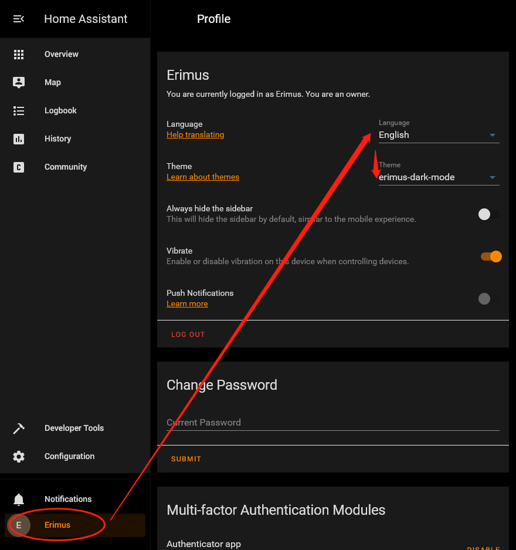

- 这里 **语言** 我们选中文。  

- **主题** 可以选 `erimus-dark-mode`，也可以保持默认。  
    对应的文件在 `./themes/erimus_dark_mode.yaml`。有兴趣可以自己制作主题。我这个为了配合黑色的手机，颜色比较深。

- 语言/主题设置是 **跟随设备** 的。所以如果你用手机打开这个页面，就需要再设置一次。

#### 5.2 重启和读取配置文件

- 以后我们修改了配置文件，HA 都需要重新读取才能生效。有些文件可以在运行过程中直接读取刷新，比如分组 / 脚本 / 自动化。但其它大部分需要重启整个 HA 来重新载入配置文件。

- 点击 `配置`，然后点右侧`服务器控制`，可以看到如下页面。
    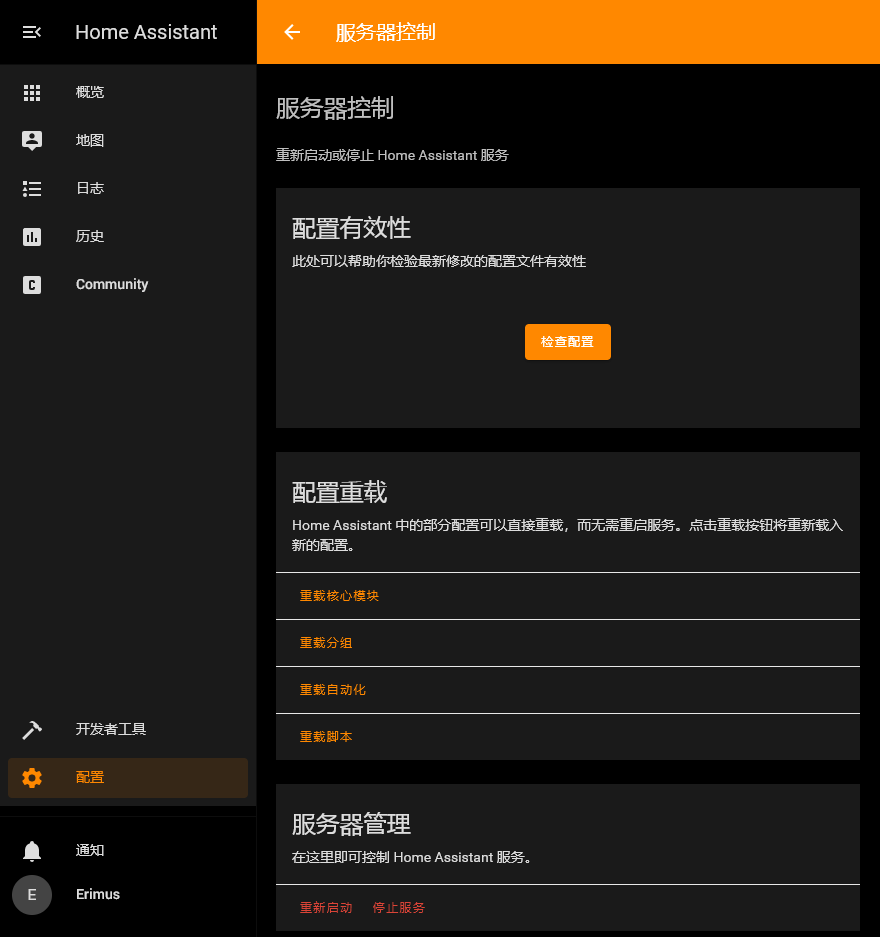

- 你可以考虑浏览器留一个 tab，保持在这个页面。因为后面你改了配置文件，会频繁地需要重启。我重启了有几百次吧……  
    你可以按住 `ctrl` 然后点 `开发者工具`，在新标签页里开始我们的下一步。

#### 5.3 开发者工具
这里常用来检查状态，或者测试命令，等等。我常用的三个标签是状态、服务、模板，下面分开来讲一下。

##### 状态

- 这里是查看 sensor 或者 switch 等等实体的状态的地方。

- 往下翻能看到几个开关的状态，但因为这些开关都是我配置的，并没有真实数据。但无所谓，先看个大概。  
    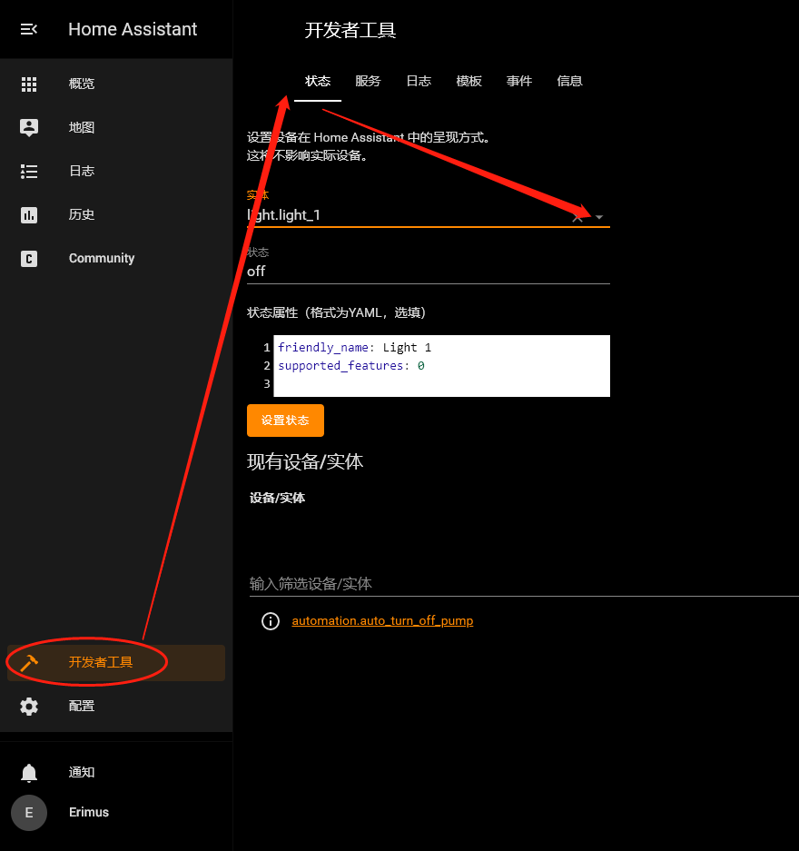

- 随便选一个实体（实体怎么来的后面会说），下面就会出现该实体的状态 `state` 和属性 `attribute`。将来如果你要手动改状态，比如图上的 off 改成 on，然后点 `设置状态`。那这个实体的状态就会被刷新了。

- 在测试自动化的时候，经常需要手动修改状态，以达到触发条件。（你总不能离家五分钟再跑回来，只为了测试一次吧。）另外在使用天气或者其它 sensor 的时候，也需要来这边查看状态和细节属性。

##### 服务
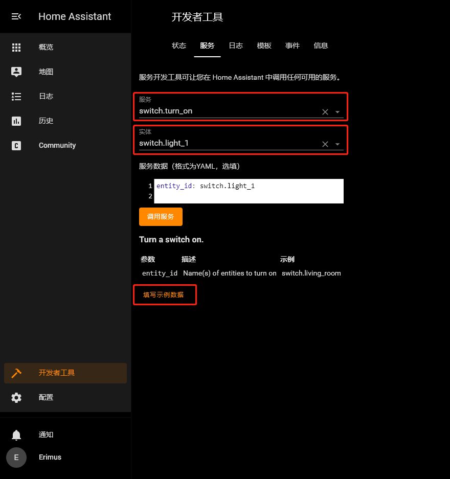

- 第一个红框 `服务`，意味着 "**做什么**"。第二个红框 `实体`，意味着 "**对谁做**"。

- 图上是一个很简单的例子，`switch.turn_on` 就是打开开关。然后开哪个开关呢，就是 `switch.light_1` 这个开关。

- 如果你配置好了 switch 或者其它实体，就可以在这里测试是否生效。

- 关于服务
    + 里面东西没有很多，就是几个大类各自的指令。  
    + 可以键入关键字，它会提示相关指令。比如 `turn_on`，它就会告诉你哪些类型可以被 `turn_on`。  
    + 另外有一些命令，比如 `homeassistant.turn_on`，可以包揽所有类型的 `turn_on`。

- **关于实体**
    + 这里可以开始注意的是，实体的写法都是 `domain.entity_id`。  
    + 比如这里的 switch，我们就可以去 `configration.yaml` 这个总的配置文件里面找 `switch`，发现 `switch: !include switch.yaml`，也就说要去 `switch.yaml` 里找。  
    + 在 `switch.yaml` 里，在 65 行左右（可能将来会变化），找到 `light_1:`。  
    + 到这一步，可以想见，我们用服务 `switch.turn_on`，运行的就是这个 `light_1` 下面的 `command_on` 的内容。
    + 这里 `switch` 就是 `domain`，也就是 HA 支持的一些大类。而 `light_1` 就是 `entity_id` 。

- 有些复杂的服务，需要填写服务数据，也就是参数。点 `填写示例数据`，可以填入参数样本，然后按需修改。

##### 模板
模板是用来测试 template 的地方。  
初学者一时用不上，就不展开了。反正知道有这么个地方就行。

### Step 6. 修改配置文件

- 打开 `sensor.yaml`，取消注释第 7-16 行。  
左：修改前，右：修改后。
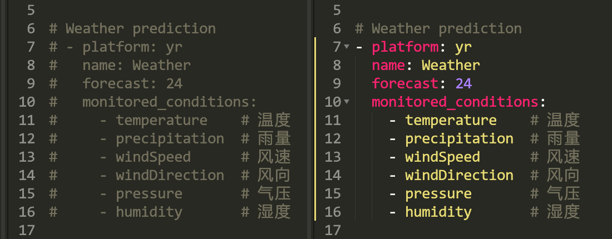

    > 强烈推荐非程序员朋友，也拥有一款编辑器。  
        我个人使用的是 [Sublime Text](https://www.sublimetext.com/)。  
        这样你可以看到彩色的代码，及时发现格式错误。  
        同时可以框选这些行，然后按 `ctrl+/` 一次取消多行注释，而不是一行行去删 `#`。

- 这相当于我们添加了一个天气的感应器。保存该文件，并重启 HA 。

- 重启完毕后，我们先进入 `状态` 查看一下这个 `sensor` 有没有生效。搜索 `sensor.weather_temperature`，应该能看到  
    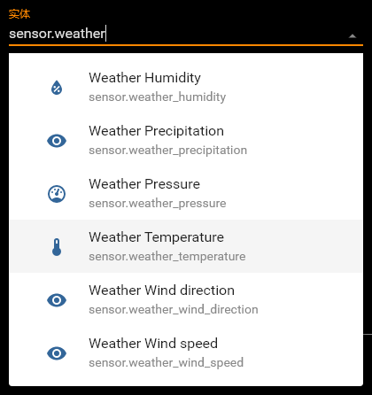

- 这说明新的 `sensor` 添加成功。

### Step 7. 添加前端面板

- 回到 HA 的首页，也就是 `概览`。

- 点击右上角的三个点，然后选`配置UI`。  
    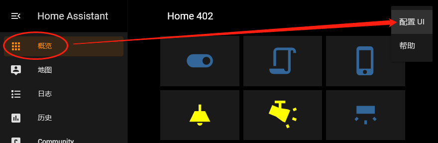

- 界面会进入编辑模式，这时右下角会有一个圆形带加号的按钮，点击。

- 在一大堆卡片类型里，选择 `历史图表`。

- 在 `实体` 一栏，选择 `sensor.weather_temperature`。  
    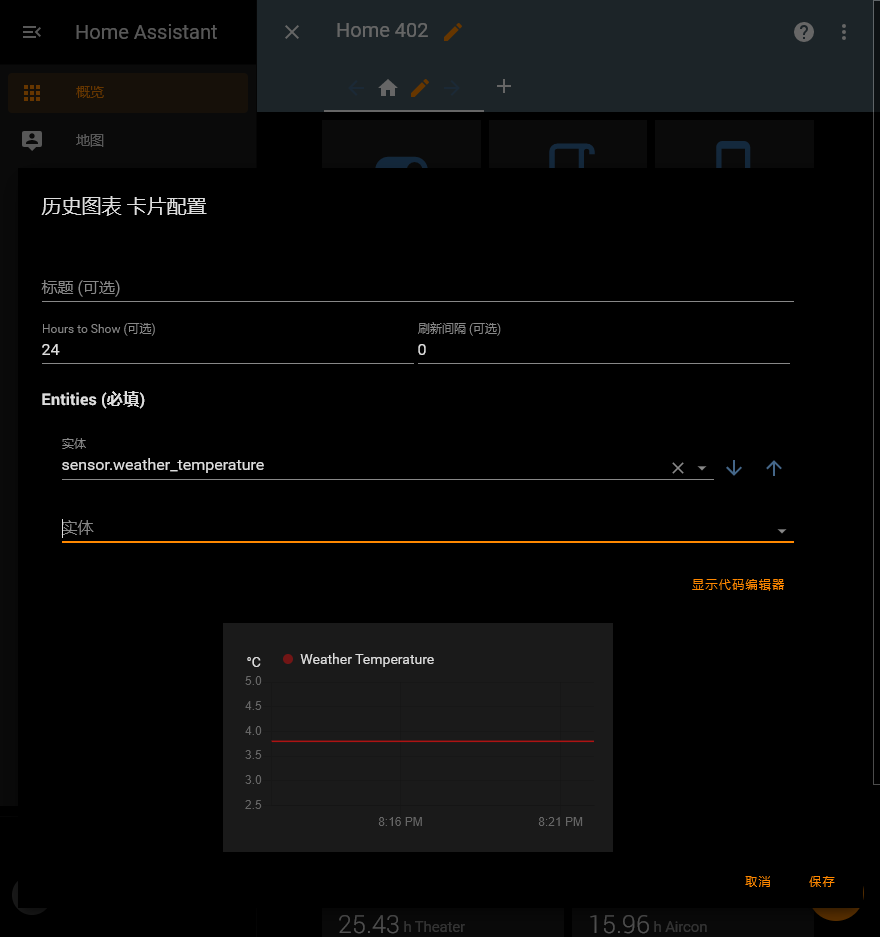

- 这时候可以看到预览，因为我们刚添加完这个传感器，所以没有历史数据。

- 按右下角 `保存`，在页面上就可以看到我们刚增加的面板了。

- 最后按左上角，房间名左侧的 `✖`，退出编辑模式。就能看到我们的卡片的最终样式了。  
    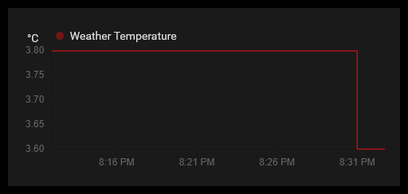

- 这就是 **一个完整的流程**
    + 我们 **修改配置文件** 添加了一个传感器
    + 保存然后 **重启 HA** 让新配置生效
    + 在状态里确认新传感器添加成功（可省略）
    + 最后把这个传感器 **放到前端网页** 上

- 一开始用得最多的卡片是 `实体` 卡片，新添加的比如开关等等，基本都先加到实体卡里试下效果。

---

我们的教程大致到这里就可以 **告一段落** 了。  

后续可以直接看我的配置文件，和文件内的一些注释，我写得还满详细的。  
大家可以配合自己的智能设备，实际添加一个，然后加到页面进行控制，那样比较有成就感。  

我的目的只是帮助新玩家快速的熟悉和入门，之后能玩的很多很多。  
至于深入和扩展的功能，我也是初学者，全靠 google 和 [官方论坛](https://community.home-assistant.io/) 。  
如果有疑问或者想指正，可以通过 "-讨论区-" Issues 来交流。  

根目录下 `home-assistant_v2.db` 是个 sql，记录了历史状态等内容。  
然后 `.storage` 文件夹里，也记录了一些账号等内容。lovelace 的配置文件也在里面。  
要做 git 备份的，可以直接参考我的 `.gitignore`。  

后面再稍微补充一点内容。

---

## 移动端的使用

- 你运行 HA 的设备会有一个 ip，比如我的是 `10.0.0.12`。那么在手机 safari 浏览器，输入 `10.0.0.12:8123`，冒号要英文的，应该就可以看到前端页面。

- 如果看不到，可能是你的设备有防火墙，可以关闭防火墙测试一下。如果确定是防火墙问题，再自行搜索解决方案。

- 在 safari 浏览器，点击底部正中的 `转发` 按钮，然后 `Add to Home Screen` 添加到主屏幕。这样以后调用会比较方便，页面也更美观。

- HA 也有官方的 App，支持 iOS 的通知消息，还可以跟踪定位信息。但我登陆有问题，还没解决，有兴趣的可以自己看看。

## iOS Home App

- 直接看这个吧，[HomeKit - Home Assistant](https://www.home-assistant.io/integrations/homekit/)，下面有一段 setup。我已经添加好了，懒得重搞一遍了，反正挺简单的。  
    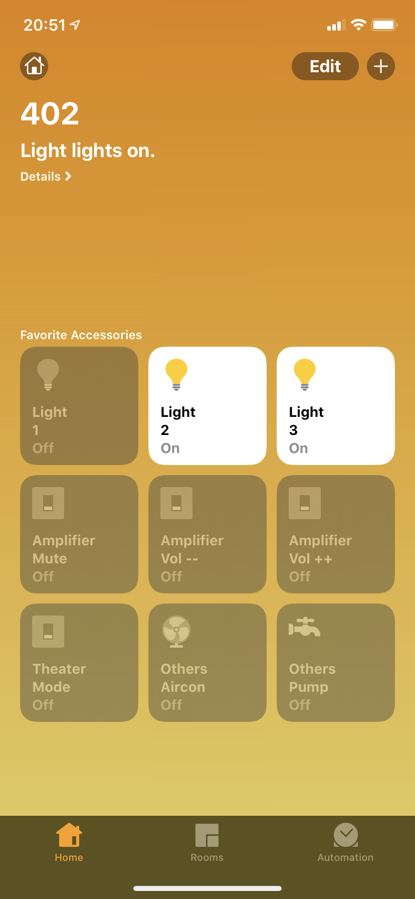

- 后续可以把 home 添加到 control center，就是右上角下划那个界面。

- 或者加入 `捷径`，然后把捷径放到 -1 屏，也就是 widget 那屏，可以快速调用。

- Siri 的话也可以，我英文系统就是 `turn on/off xxx`。会自动 **识别 group**，开关全部灯。也支持 **组合命令**，比如 xxx and zzz，它会执行两组命令。  

- 如果锁屏无法语音控制 Home，提示要先解锁。需要到 iPhone设置 / face id & passcode / ALLOW ACCESS WHEN LOCKED，打开 Home Control。

## 一些感想

- 老式的控制器最大的问题，是无法 **反馈状态**。  
    比如我的很多遥控器，开关按钮是同一个。如果有一次发送失败，HA 记录的当前状态就会出错。或者你偶尔用传统遥控器控制了设备，那设备的状态也不会反馈到 HA 。所以用上 HA 之后，我基本没用过传统遥控器。

- 最便宜也是最 **通用** 的改造方案，应该就是万能遥控 + 智能开关 + 智能插座。  
    遥控器咸鱼100，单红外的更便宜些，插座和开关30几一个，基本几百块钱就能完成全屋改造。而且不需要替换掉现有的电器，也不必特地买一些昂贵又不成熟的智能产品。就是简单在现有线路上，加一个控制器，基本是无痛接入。

- **用电安全** 最重要。  
    智能设备还比较新，有一些负载或安全问题，可能需要时间来验证。另外像电动窗帘这类，靠近易燃材料的，有些还带电池且长期日晒的，都需要注意相应的防护工作。

- **设计安全** 优先。  
    比如一些自动化等功能，必须考虑被误触发的可能，要优先考虑避免极端情况。 
有些用例，用来控制宠物的喂食换气等等，毕竟涉及生命，就需要有容错的设计。

- **网络安全** 也很重要。  
    技术太菜的厂家有可能被攻击破解，技术太好的厂家没准又会多采集不少隐私，都有风险。玩 HA 也是为了完全接管，可以通过路由器把设备隔离起来。另外如果实在不得不拿隐私换便利，那 **尽量把秘密告诉给不相关的人**。国内厂商更有可能，更加 "充分地" 利用你的隐私来获利。而国外厂商，即便想拿你的隐私卖广告，也未必能骚扰得到你。

- **硬件隔离**  
    比如需要使用网络摄像头的，可以考虑加装一个智能插座。然后通过自动化，在你在家的时候，自动把摄像头移向死角，并切断摄像头插座的电源。从硬件上杜绝被偷拍的可能。

# 附录

- [Integrations - Home Assistant](https://www.home-assistant.io/integrations/) 所有可以整合的设备服务一览
- [Home Assistant Demo](https://demo.home-assistant.io/#/lovelace/0) Lovelace 的示范页面
